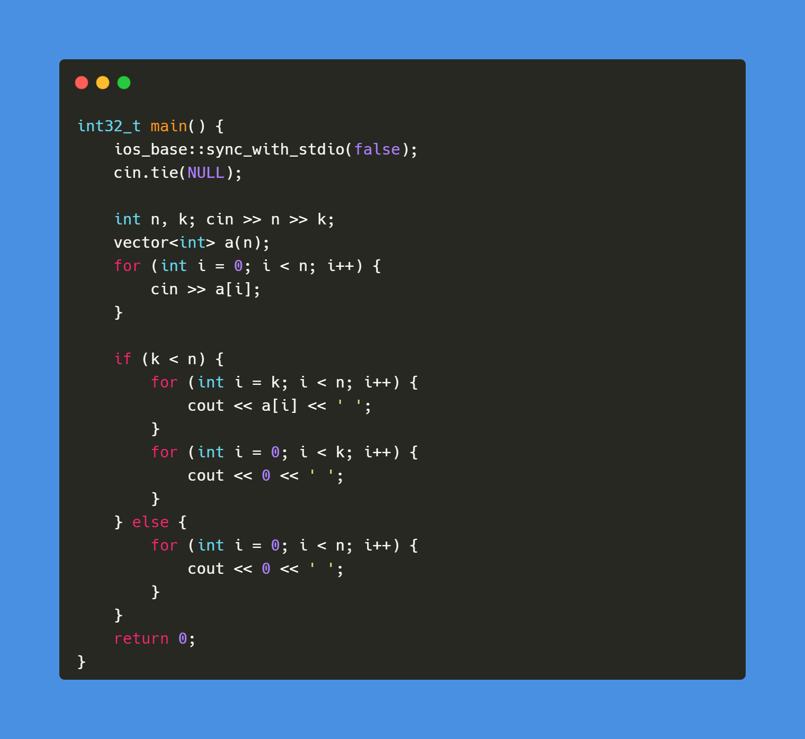
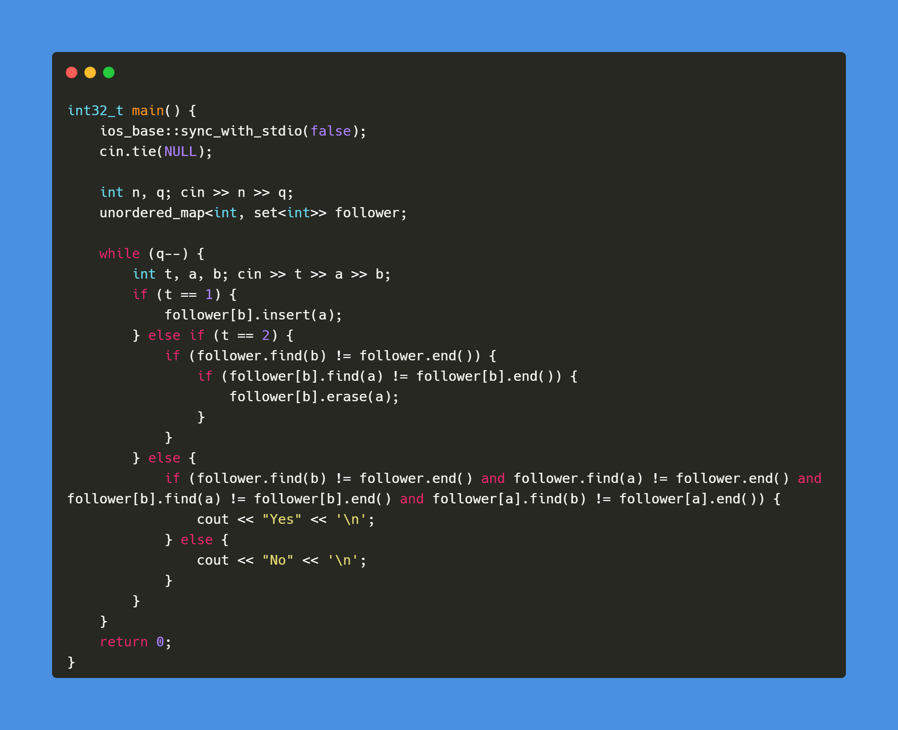
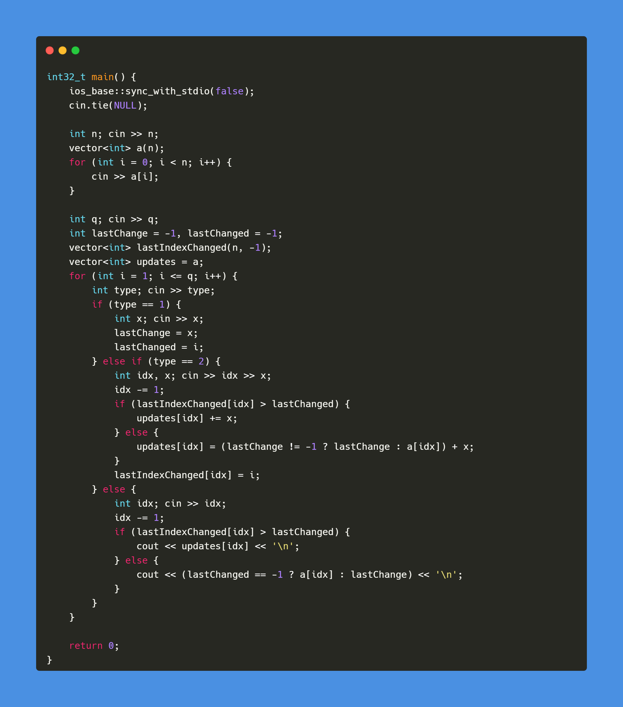
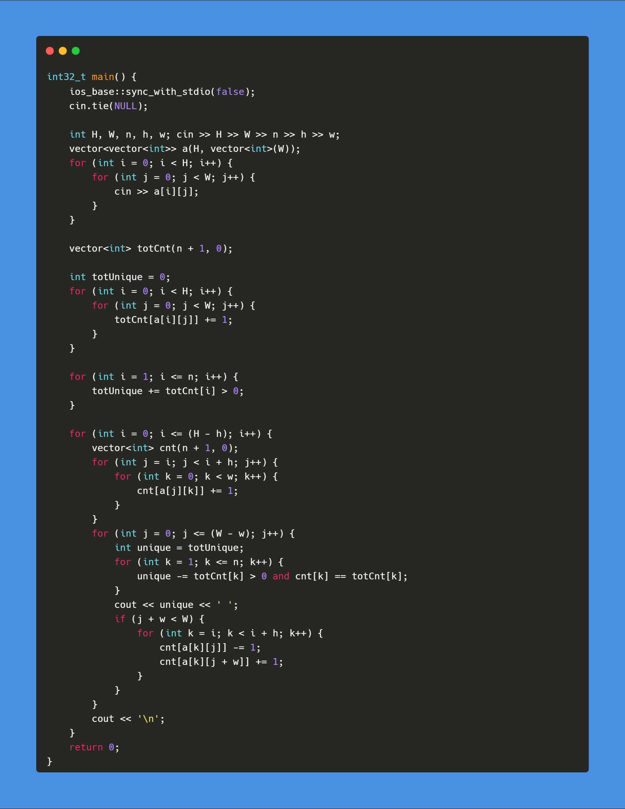

[A - Shift](https://atcoder.jp/contests/abc278/tasks/abc278_a)

Solution

 
 
 

[B - Misjudge the Time](https://atcoder.jp/contests/abc278/tasks/abc278_b)

Solution

 
 
 

[C - FF](https://atcoder.jp/contests/abc278/tasks/abc278_c)

Solution

 
 
 

[D - All Assign Point Add](https://atcoder.jp/contests/abc278/tasks/abc278_d)

Solution

 
 
 

[E - Grid Filling](https://atcoder.jp/contests/abc278/tasks/abc278_e)

Solution

