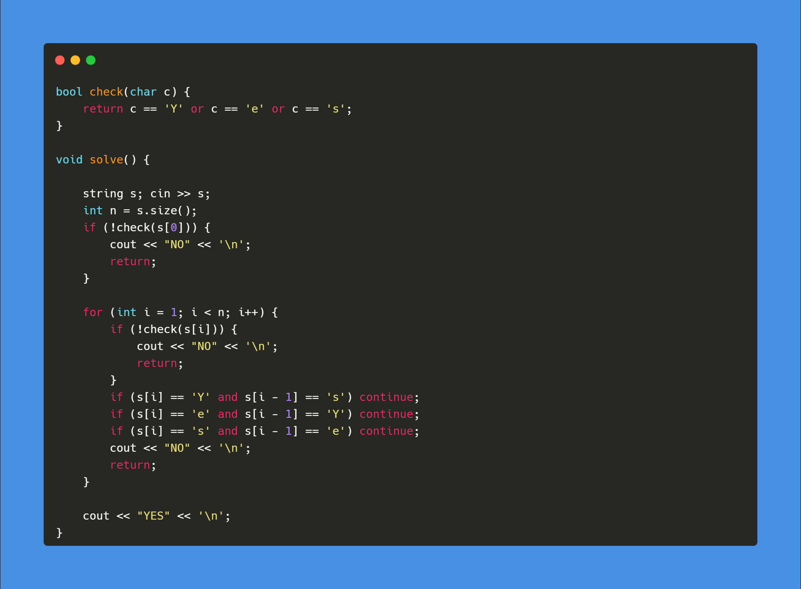
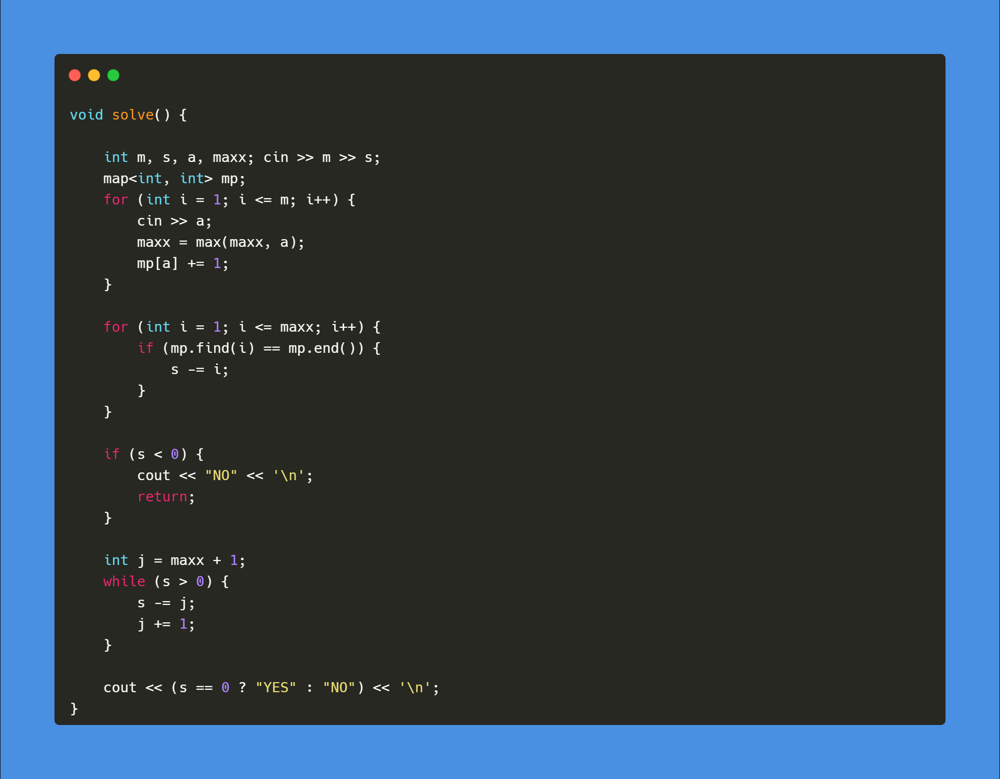
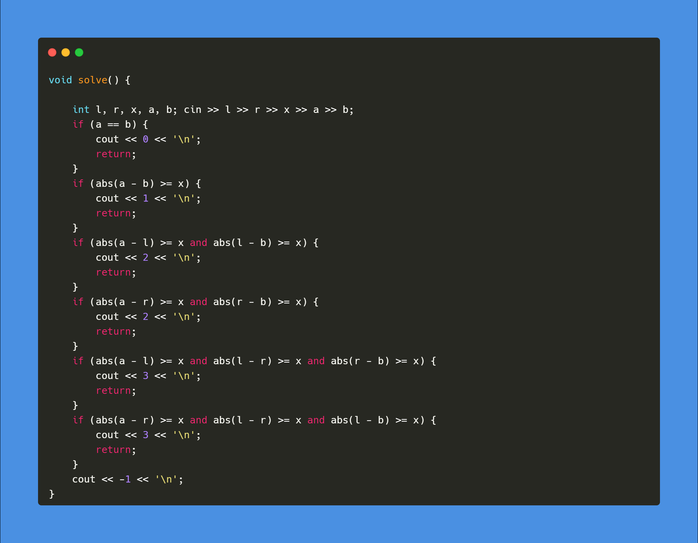
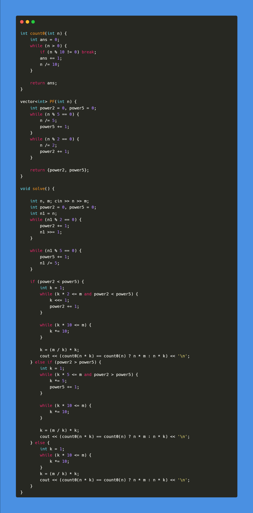
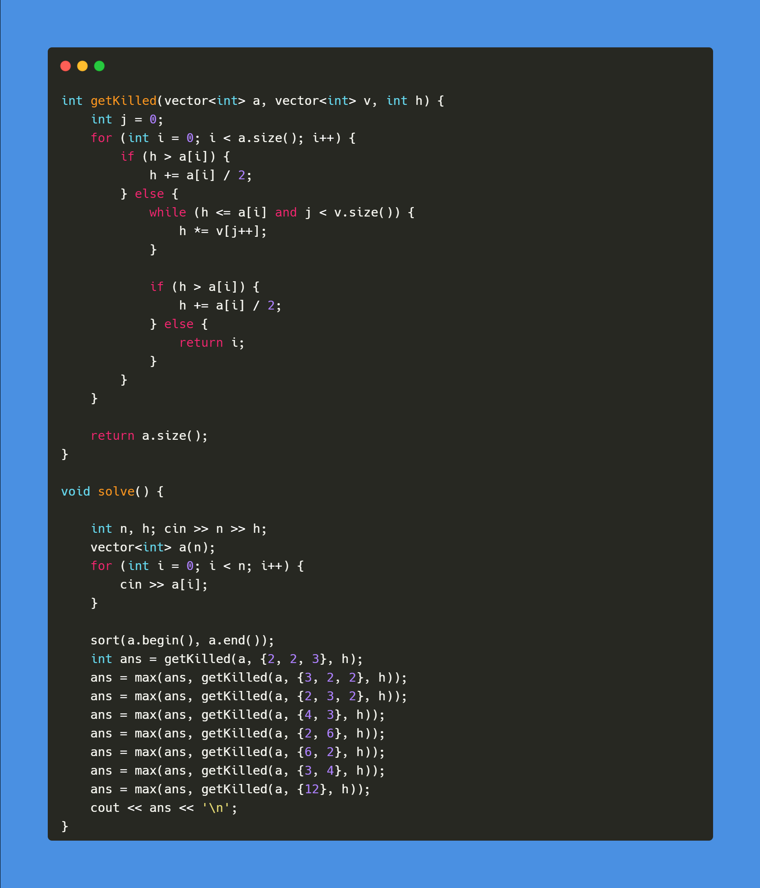
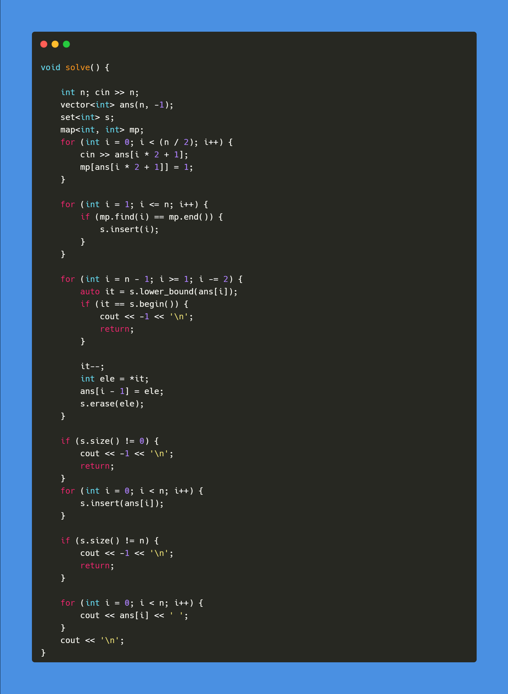

[A. Yes-Yes?](https://codeforces.com/contest/1759/problem/A)

Solution

 
 
 

[B. Lost Permutation](https://codeforces.com/contest/1759/problem/B)

Solution

 
 
 

[C. Thermostat](https://codeforces.com/contest/1759/problem/C)

Solution

 
 
 

[D. Make It Round](https://codeforces.com/contest/1759/problem/D)

Solution

 
 
 

[E. The Humanoid](https://codeforces.com/contest/1759/problem/E)

Solution

 
 
 

[G. Restore the Permutation](https://codeforces.com/contest/1759/problem/G)

Solution

 
 
 
