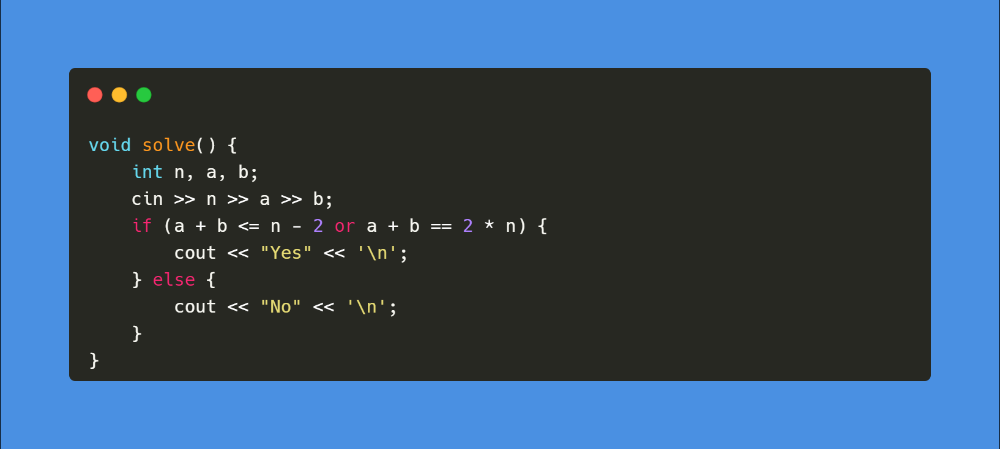
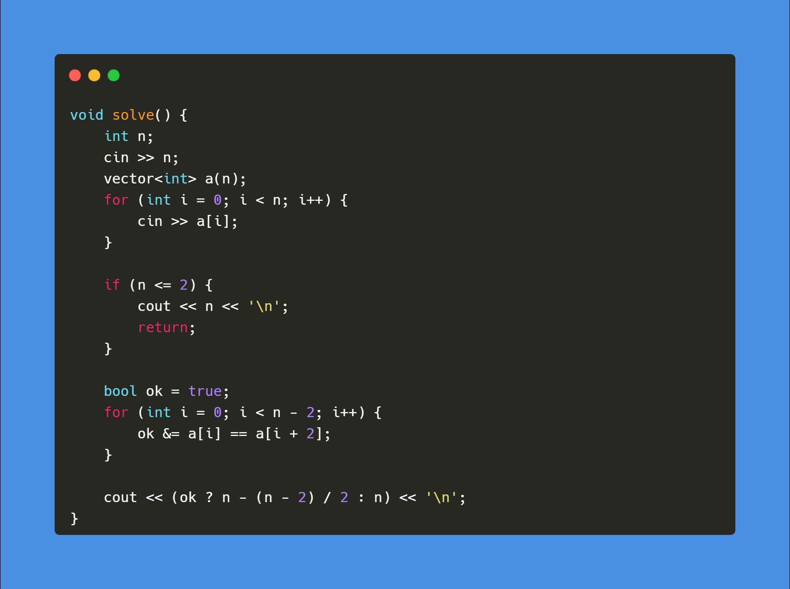
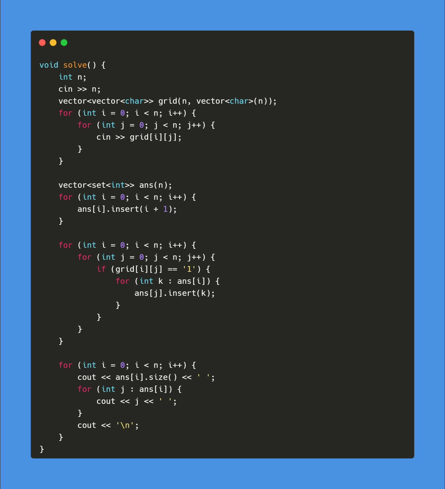

[A. Two Permutations](https://codeforces.com/contest/1761/problem/A)

Solution

 
 
 

[B. Elimination of a Ring](https://codeforces.com/contest/1761/problem/B)

Solution

 
 
 

[C. Set Construction](https://codeforces.com/contest/1761/problem/C)

Solution

