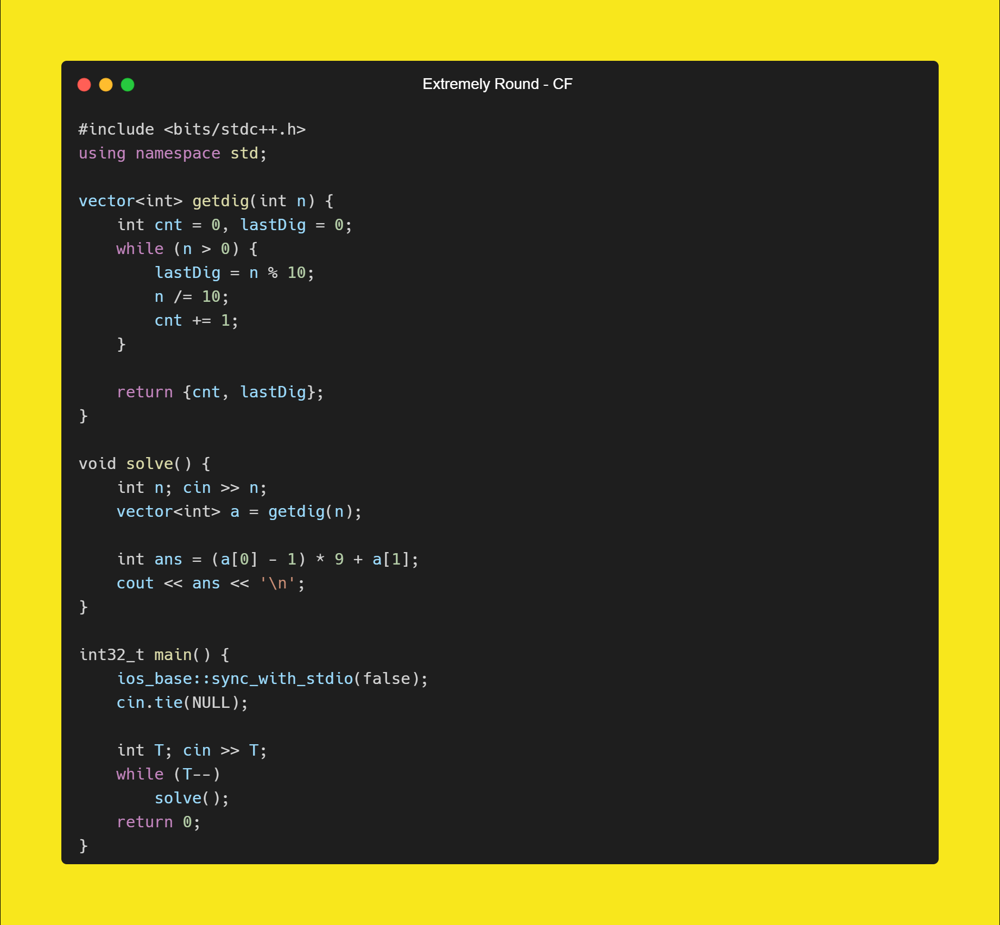
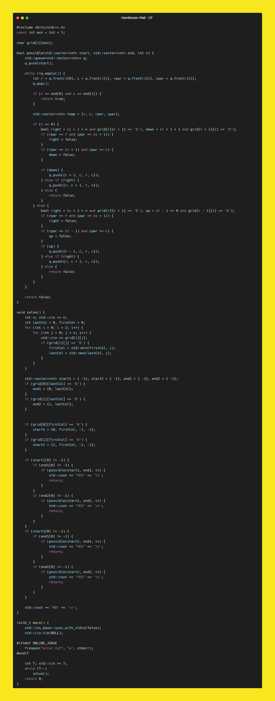
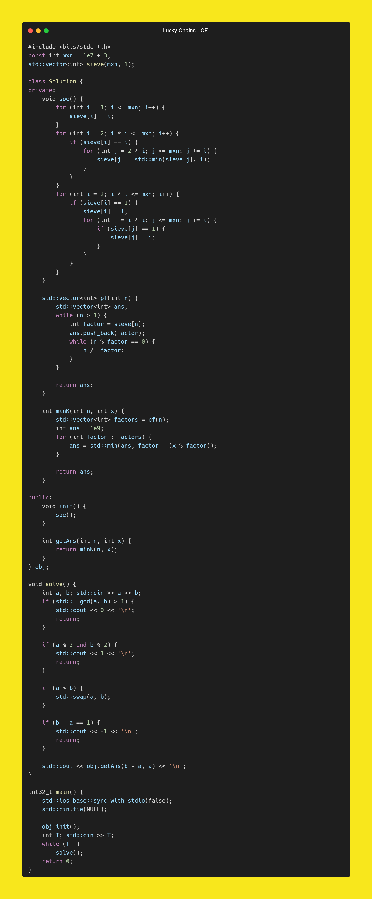

[A. Extremely Round](https://codeforces.com/contest/1766/problem/A)

Solution

 
 
 

[B. Notepad#](https://codeforces.com/contest/1766/problem/B)

Solution

 
 
 

[C. Hamiltonian Wall](https://codeforces.com/contest/1766/problem/C)

Solution

 
 
 

[D. Lucky Chains](https://codeforces.com/contest/1766/problem/D)

Solution

