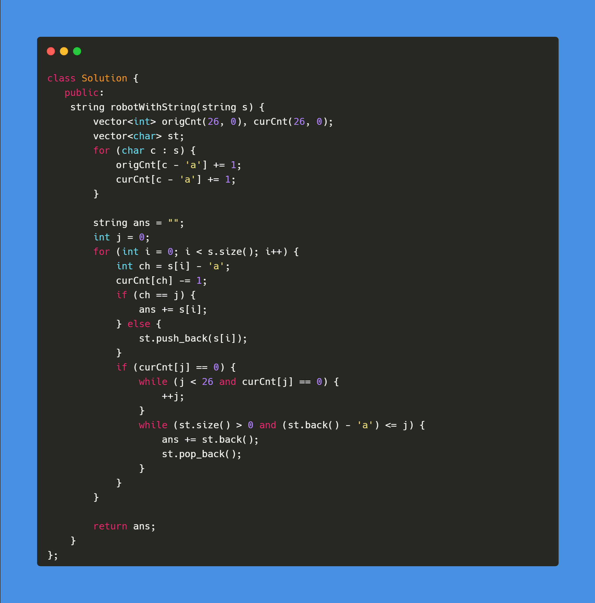

[2434. Using a Robot to Print the Lexicographically Smallest String](https://leetcode.com/contest/weekly-contest-314/problems/using-a-robot-to-print-the-lexicographically-smallest-string/)

Solution

