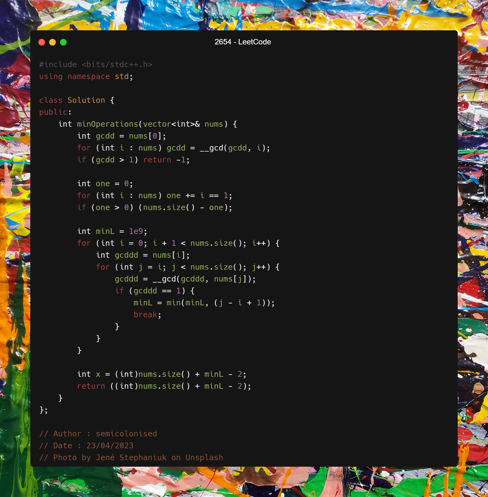

[2654. Minimum Number of Operations to Make All Array Elements Equal to 1](https://leetcode.com/contest/weekly-contest-342/problems/minimum-number-of-operations-to-make-all-array-elements-equal-to-1/)

Solution

