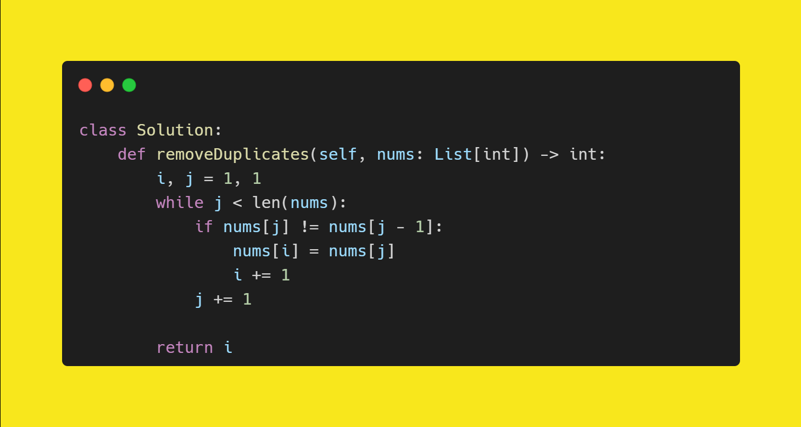

C++ code

Runtime: `24 ms`, faster than `57.76%`.
Memory Usage: `18.4 MB`, less than `37.30%`.

 

Python code

Runtime: `87 ms`, faster than `96.54%`. 
Memory Usage: `15.6 MB`, less than `66.20%`.

