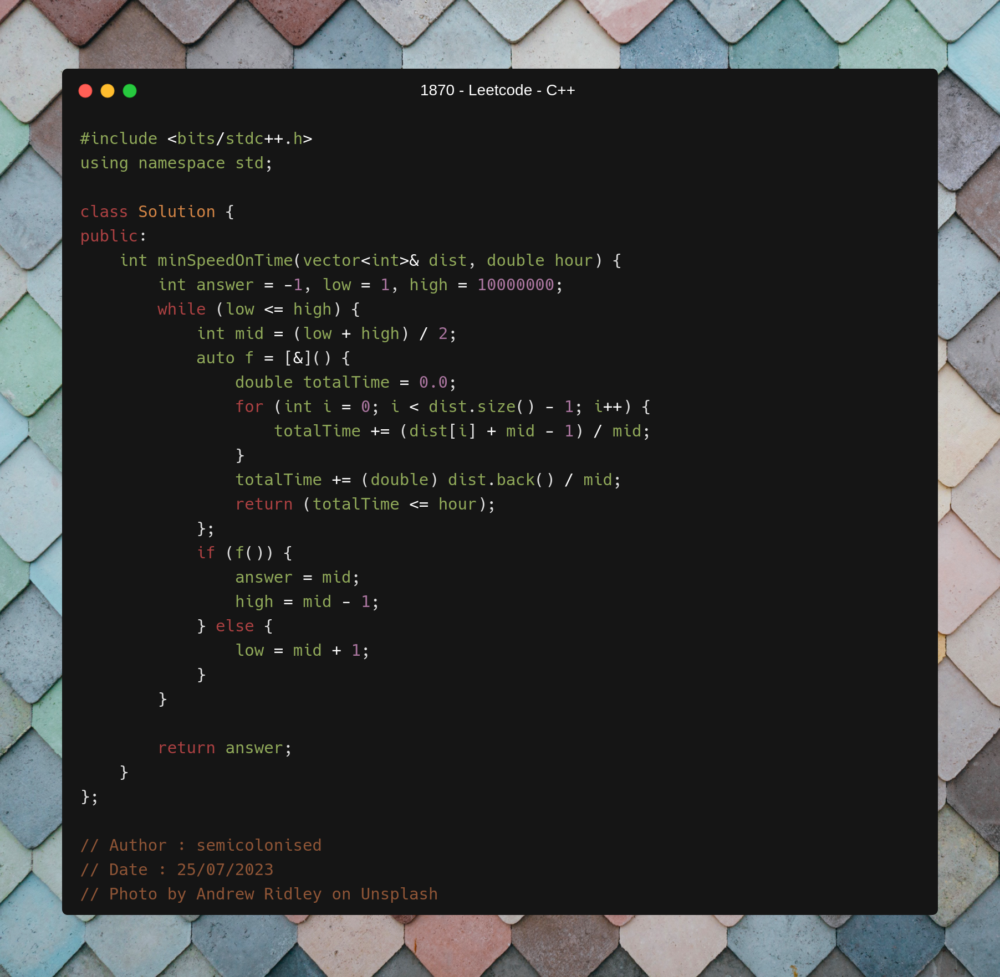
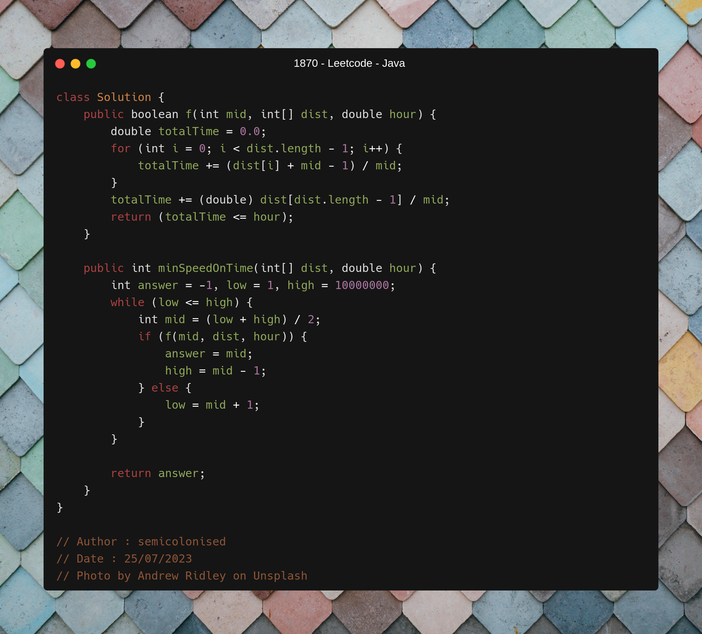
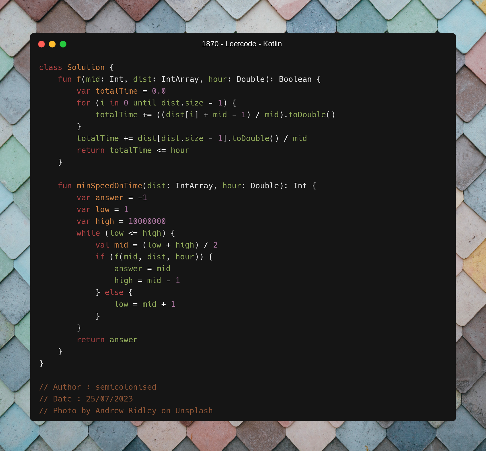

C++ code

Runtime `412 ms` Beats `26.91%`. 
Memory `101.3 MB` Beats `94.10%`.

  

Java code

Runtime `71 ms` Beats `92.4%`. 
Memory `59 MB` Beats `68.17%`.

  

Kotlin code

Runtime `608 ms` Beats `80.00%`. 
Memory `51 MB` Beats `100.00%`.

  