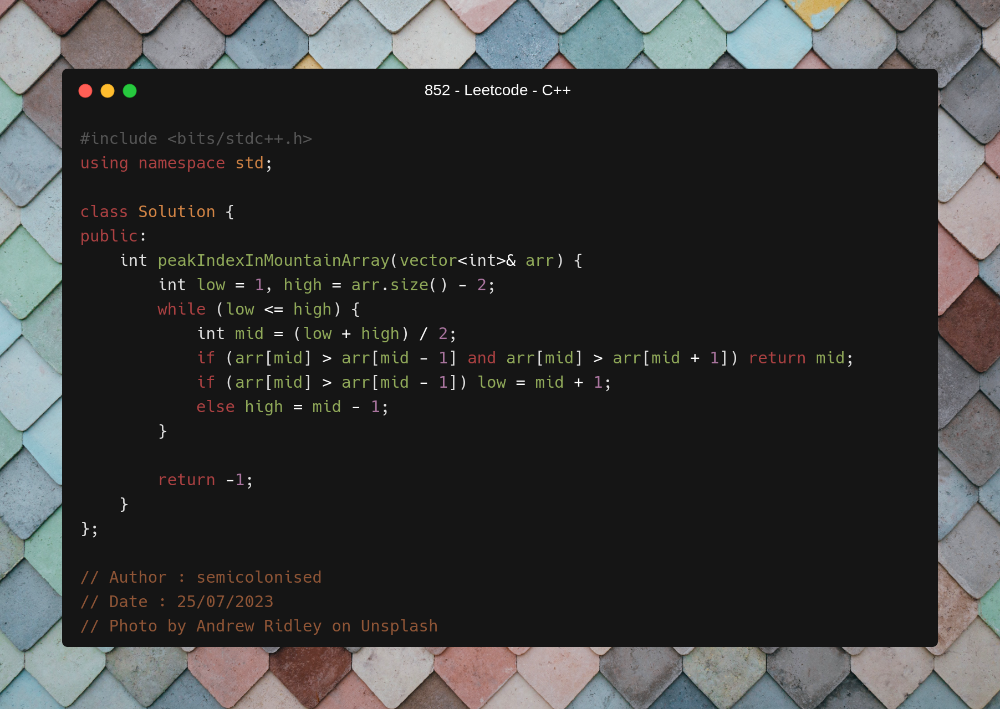
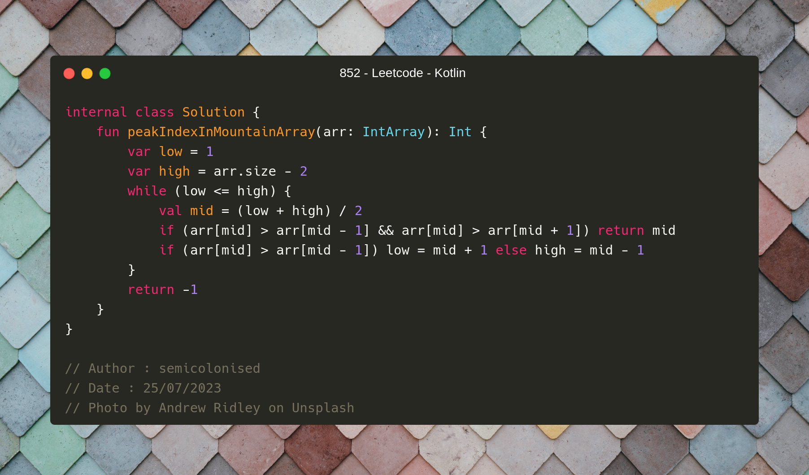

C++ code

Runtime `121 ms` Beats `77.28%`. 
Memory `59.6 MB` Beats `40.39%`.

  

Java code

Runtime `0 ms` Beats `100%`. 
Memory `56.9 MB` Beats `27.34%`.

  

Kotlin code

Runtime `546 ms` Beats `9.30%`. 
Memory `52 MB` Beats `67.44%`.

  