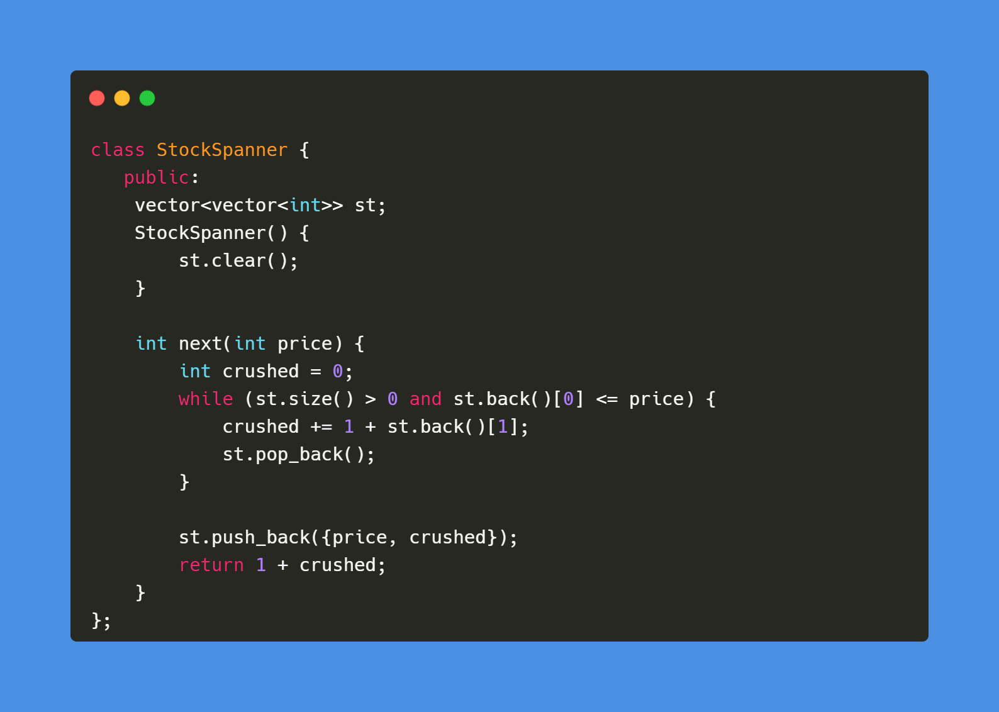

C++ code

Runtime: `607 ms`, faster than `6.96%`. 
Memory Usage: `90.8 MB`, less than `5.16%`.

 

Python code

Runtime: `518 ms`, faster than `80.46%`. 
Memory Usage: `19.6 MB`, less than `39.40%`.

