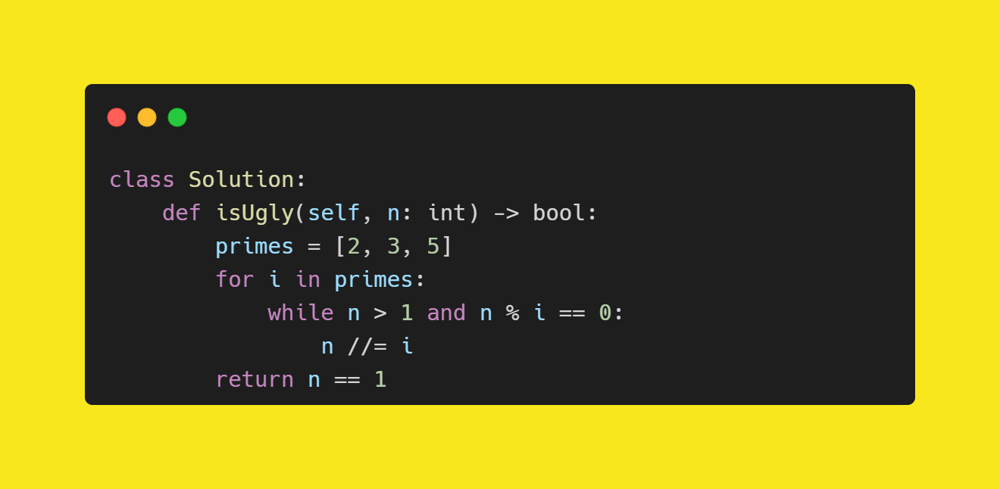

C++ code

Runtime: `0 ms`, faster than `100.00%`. 
Memory Usage: `5.8 MB`, less than `69.56%`.

 

Python code

Runtime: `61 ms`, faster than `49.73%`. 
Memory Usage: `13.8 MB`, less than `60.08%`.

