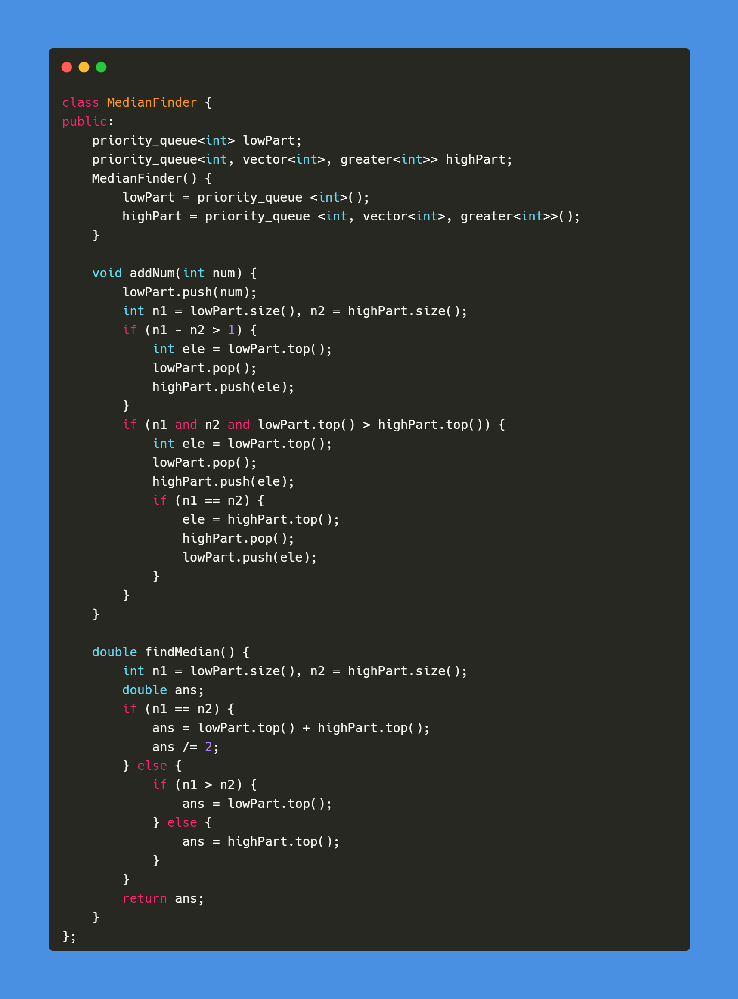

C++ code

Runtime: `491 ms`, faster than `77.53%`. 
Memory Usage: `117.1 MB`, less than `65.05%`.

 

Python code

Runtime: `2089 ms`, faster than `13.86%`. 
Memory Usage: `36.9 MB`, less than `5.14%`.

